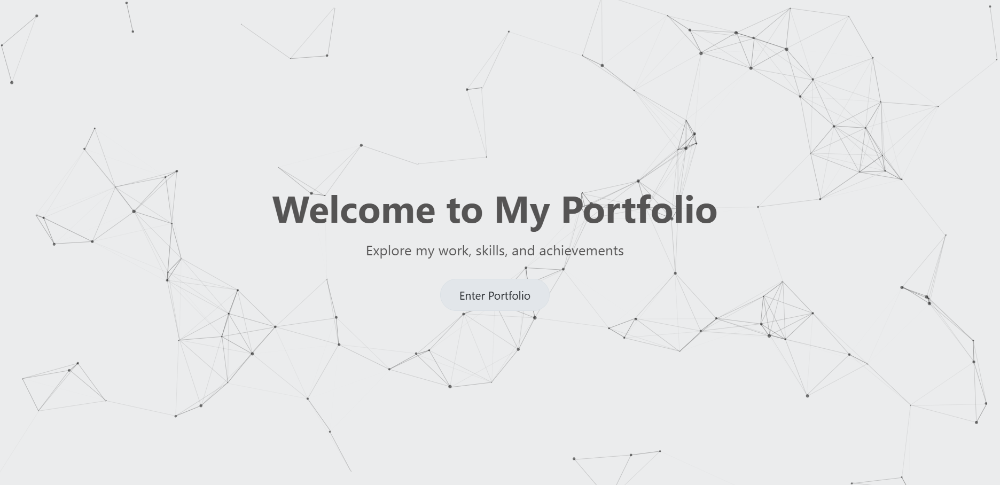
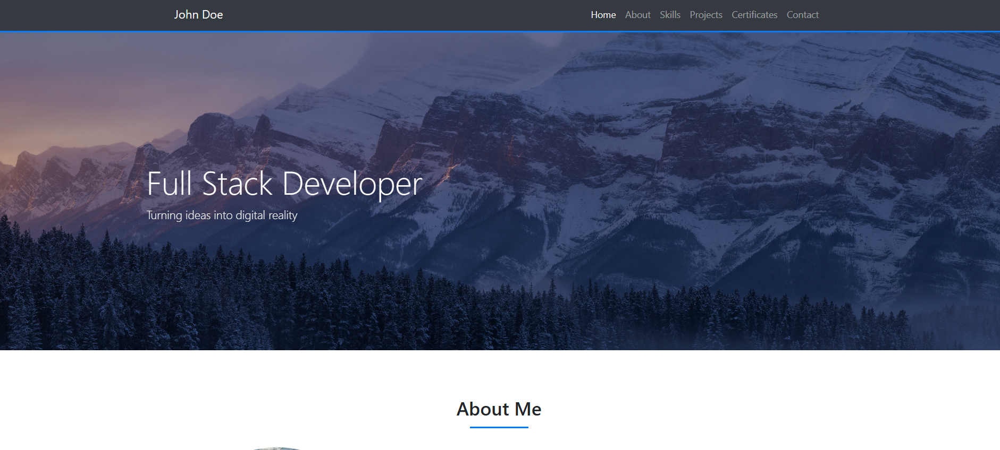
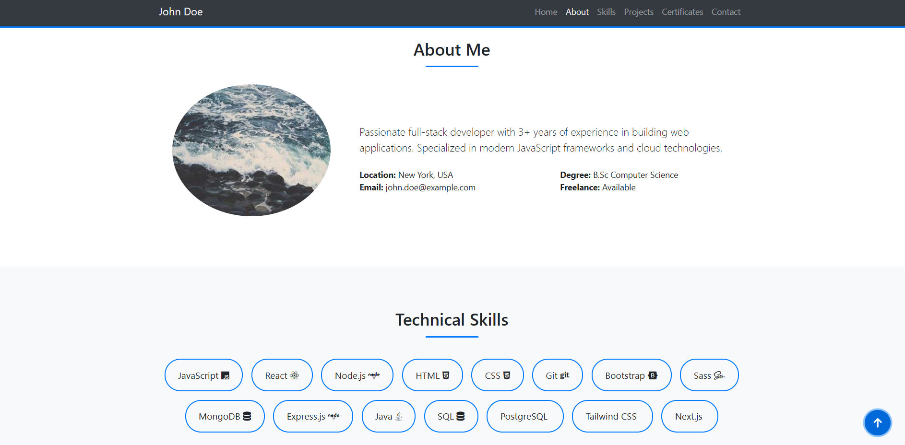
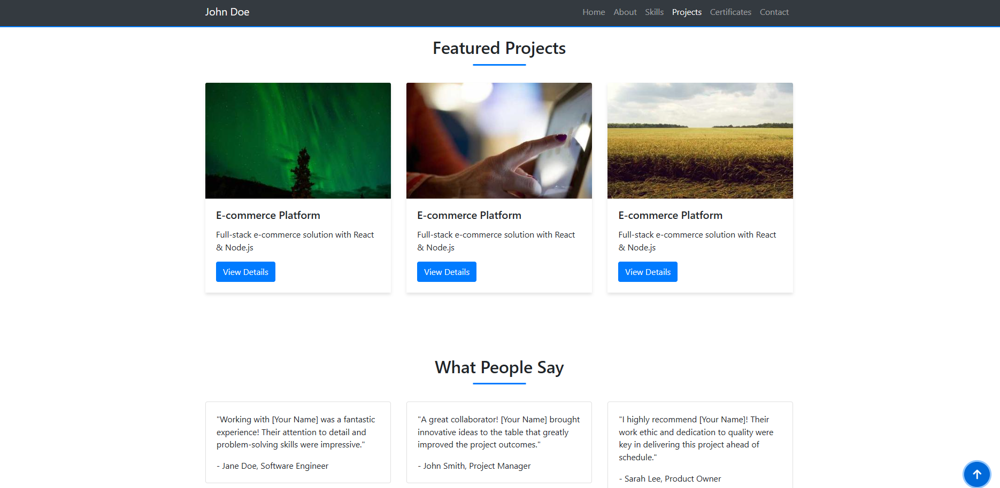
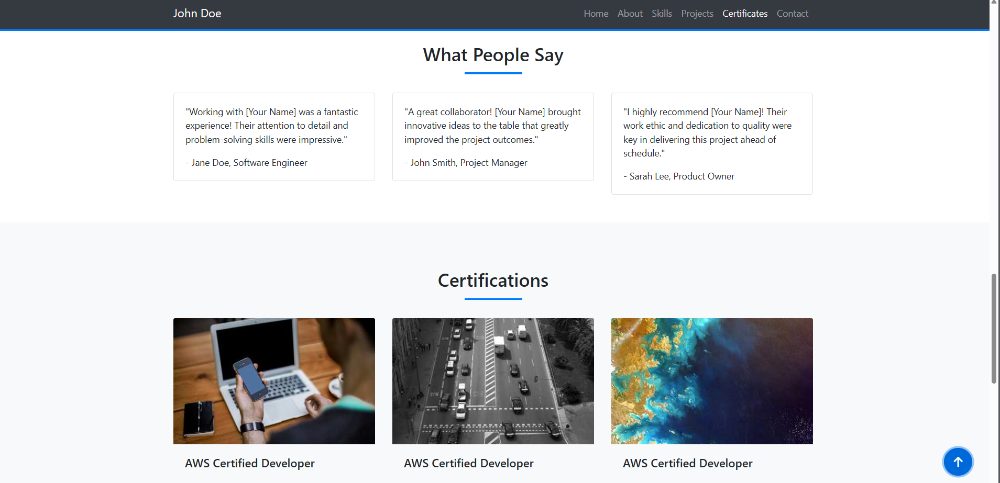
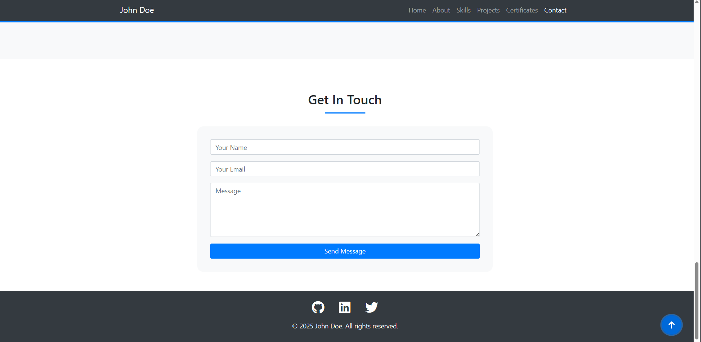

# Modern Portfolio Website

**Company**: CodeTech IT Solutions  
**Name**: Mayank Verma  
**Intern ID**: CTO4WY20  
**Domain**: Front End Development  
**Duration**: 4 Weeks  
**Mentor**: Vaishali Shrivastava


A clean, responsive portfolio website built with HTML, CSS, Bootstrap 4, and JavaScript. Features a particle.js welcome page effect and smooth transitions.








## Features

- **Interactive Welcome Page**: Engaging particle.js animation with a button to enter the portfolio.
- **Responsive Design**: Fully responsive layout that works on all devices.
- **Modern UI/UX**: Clean design with smooth animations and transitions.
- **Bootstrap 4 Framework**: Utilizing the popular CSS framework for responsive components.
- **Dynamic Sections**: About, Skills, Projects, Testimonials, Certificates, and Contact sections.
- **Interactive Elements**: Hover effects, smooth scrolling, and scroll-to-top button.
- **Font Awesome Icons**: Comprehensive icon library integrated.
- **Easy Customization**: Well-structured code for easy modifications.


## Setup

1. **Clone the repository**
   ```bash
   git clone https://github.com/Mayank_5362/portfolio-website.git
